# Proyecto_

**Título del proyecto:** Implementación de HomeLab para prácticas de
ciberseguridad

**Autor:** Daniel Carrión

**Rol:** Estudiante de Ingeniería de Sistemas (6to ciclo)

**Correo:** [carriondaniel602@gmail.com](mailto:carriondaniel602@gmail.com) · **GitHub:** [@DanproTDT](https://github.com/DanproTDT) · **LinkedIn:** [linkedin.com/in/dacarrionsec](https://www.linkedin.com/in/dacarrionsec)

**Fecha de última actualización:** 20-05-2025

## 1. Resumen

**Objetivo General**: Diseñar e implementar un entorno virtual
controlado que permita simular escenarios reales de ciberseguridad,
incluyendo pruebas de penetración, gestión de vulnerabilidades,
monitoreo de eventos y respuesta ante incidentes. Este laboratorio busca
fortalecer habilidades técnicas mediante prácticas operativas,
integrando herramientas clave como pfSense, Suricata, Splunk, Nessus y
Active Directory.

**Alcance Técnico**: Se desplegaron servicios esenciales como Active
Directory, DNS, DHCP, IDS/IPS, SIEM y escaneo de vulnerabilidades. El
entorno incluye estaciones de trabajo, servidores Linux y Windows, y
zonas segmentadas (LAN, DMZ, WAN).

**Resultados Clave**

- Splunk recibe logs de estaciones, servidores y pfSense.

- Suricata detecta y bloquea tráfico malicioso.

- Nessus identifica vulnerabilidades en LAN y DMZ.

- Las reglas de firewall segmentan correctamente el tráfico.

## 2. Contexto y Motivación

**Motivación Personal**: La creación de este laboratorio responde al
deseo de adquirir experiencia práctica en ciberseguridad ofensiva y
defensiva. El entorno permite validar conocimientos teóricos mediante
simulaciones reales, facilitando el aprendizaje por descubrimiento y la
mejora continua.

**Retos Iniciales**

- Configuración de red segmentada con múltiples interfaces.

- Integración de herramientas con flujos de logs consistentes.

- Validación de conectividad entre zonas para escaneo autenticado.

**Beneficios Esperados**

- Consolidación de habilidades técnicas en entornos reales.

- Preparación para certificaciones como CompTIA Linux+, Security+, etc.

- Creación de un portafolio técnico demostrable.

## 3. Objetivos Detallados

- Segmentar WAN / LAN / DMZ con pfSense.

- Desplegar Active Directory + DNS en LAN.

- Integrar Suricata como IDS/IPS.

- Instalar y configurar Splunk Enterprise + Universal Forwarders.

- Ejecutar auditorías de vulnerabilidades con Nessus.

## 4. Arquitectura de Red
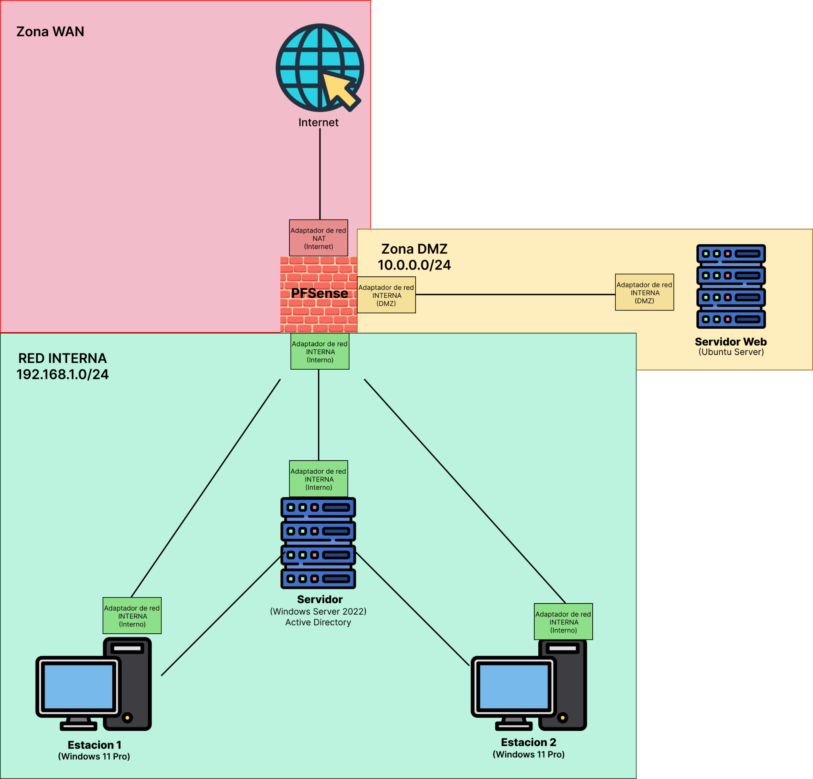

### 4.1. Tabla de Subredes

| **Zona** | **Subred**     | **Gateway** | **Función**                     |
|----------|----------------|-------------|---------------------------------|
| WAN      | DHCP ISP       | --          | Acceso a Internet               |
| LAN      | 192.168.1.0/24 | 192.168.1.1 | AD DS, Splunk, Nessus, clientes |
| DMZ      | 10.0.0.0/24    | 10.0.0.1    | Ubuntu Server, servicios web    |

### 4.2. Interfaces de pfSense

| **Interfaz** | **Adaptador** | **Tipo** | **Función**         | **IP**           |
|--------------|---------------|----------|---------------------|------------------|
| em0          | WAN           | NAT      | Conexión a Internet | Asignada por ISP |
| em1          | DMZ           | Interna  | Red pública segura  | 10.0.0.1/24      |
| em2          | LAN           | Interna  | Red interna         | 192.168.1.1/24   |

## 5. Inventario de Componentes

### 5.1. Hardware / VMs

| **Componente**      | **RAM** | **CPU** | **Almacenamiento** | **Adaptadores** | **Tipo**              |
|---------------------|---------|---------|--------------------|-----------------|-----------------------|
| pfSense             | 2GB     | 2       | 20GB               | 3               | NAT, Interna, Interna |
| Windows Server      | 4GB     | 3       | 50GB               | 1               | Interna (LAN)         |
| Ubuntu Server       | 4GB     | 2       | 30GB               | 1               | Interna (DMZ)         |
| Estaciones Win10/11 | 4GB     | 4       | 80GB               | 1               | Interna (LAN)         |

### 5.2. Software y Versiones

- pfSense 2.8.0 + Suricata 7.0.8_2
- Windows Server 2022
- Splunk Enterprise 10.0.0 + UF 10.0.0
- Nessus Essentials 10.9.2

## 6. Implementación Base

### 6.1. pfSense

- Instalación desde ISO y asignación de interfaces.  
    
  

- Configuración inicial vía HTTP desde Kali Linux temporal.  
  

- Asignación de IPs estáticas en LAN y DMZ, y DHCP en LAN.  
  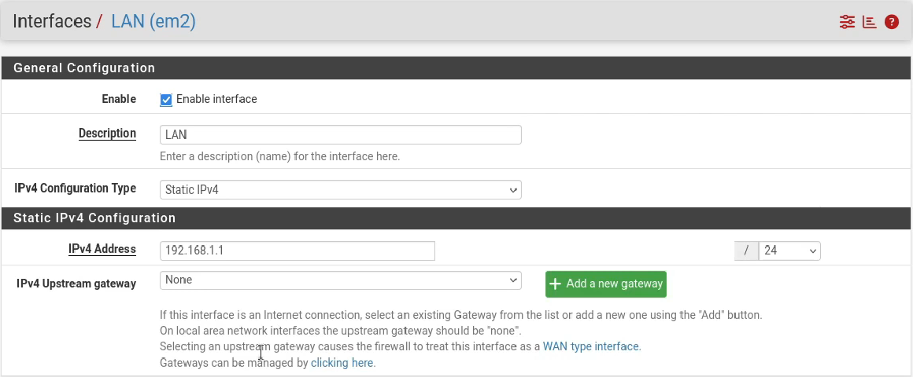  
    
  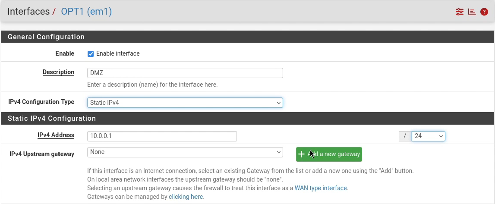

**Comentarios**

- Si no se remueve el .iso, pfSense reinicia el setup como si fuera la primera vez.
- Se usa Kali Linux como puente temporal para acceder a la gestión HTTP.
- La interfaz OPT se renombra a DMZ para reflejar su función.

### 6.2. Active Directory + DNS

- Instalación de Windows Server desde .iso.  
  

- Instalación de rol AD DS en Windows Server.  
  

- Creación de dominio: lab.ciberlabs.local.  
  

- Asignación de IP estática a Windows Server vía DHCP static mapping en pfSense.  
  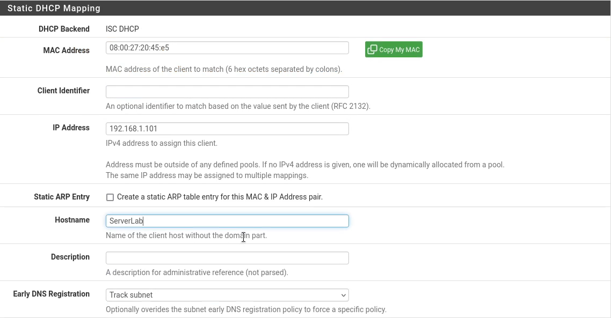

**Comentarios**

- La IP estática garantiza conectividad estable para servicios de dominio.

### 6.3. Estaciones de Trabajo + Ubuntu Server

- Instalación de Windows 11 desde .iso.  
  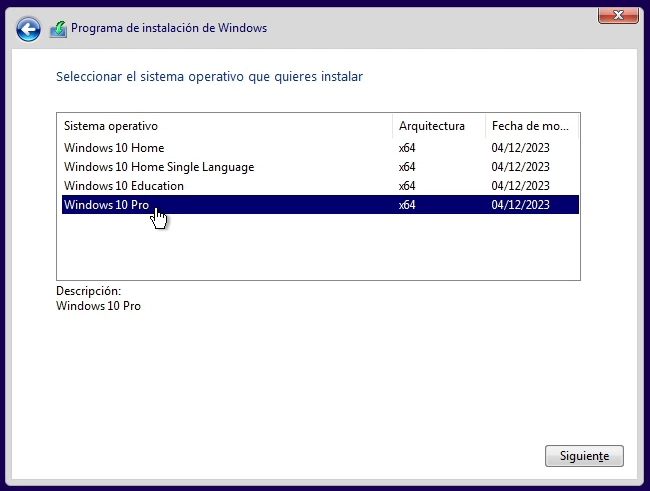

- Agregar registro a DNS Server para que las estaciones puedan obtener la IP del Windows Server.  
  

- Unión al dominio.  
    
  

- Creación de OUs (WORKSTATIONS, USERS) y usuarios (jhon1, jhon2).  
    
    
    
    
  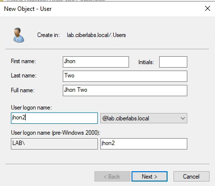

- Instalación de Ubuntu Server desde .iso  
  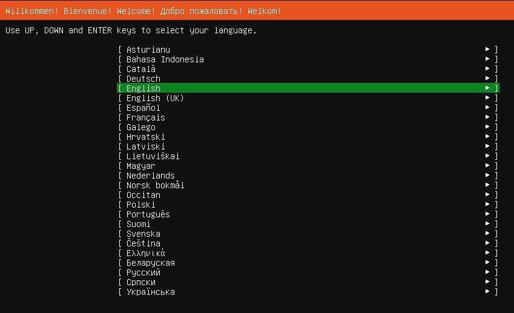  
  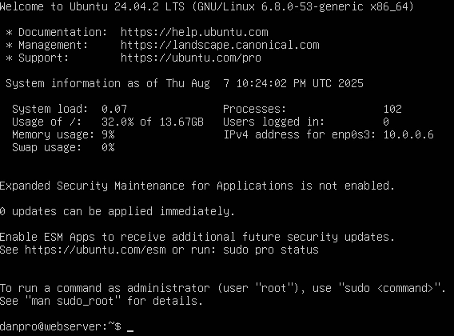

- Asignación de IP estática por DHCP Static Mapping a Ubuntu Server.  
  

- Hosting web con Apache  
  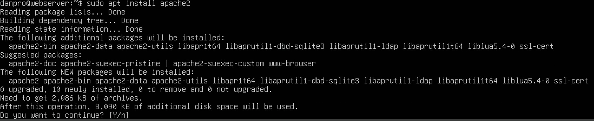  
  

- Creación de GPO para estaciones de trabajo  
  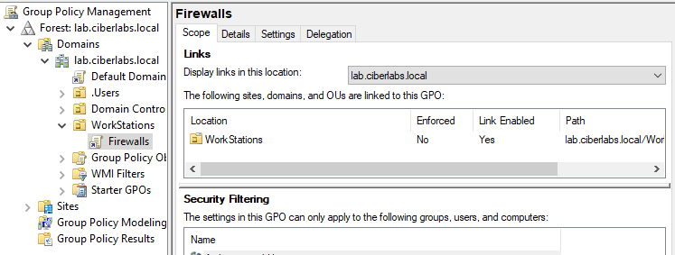

- Habilitar ICMP por firewall en GPO  
  

**Comentarios**

- El registro en pfSense es clave para que las estaciones resuelvan el dominio correctamente.
- La GPO permite verificar conectividad entre estaciones por ping.
- Apache se instala como base para futuras pruebas de penetración.

## 7. Splunk Enterprise + Universal Forwarders

### 7.1. Splunk Enterprise

- Instalación en Windows Server.  
  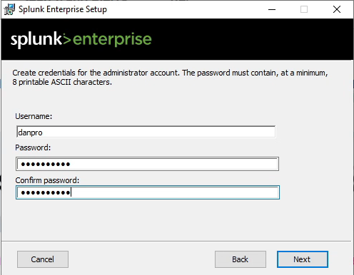  
  

- Índices creados: windows, ubuntu_server, pfsense.  
  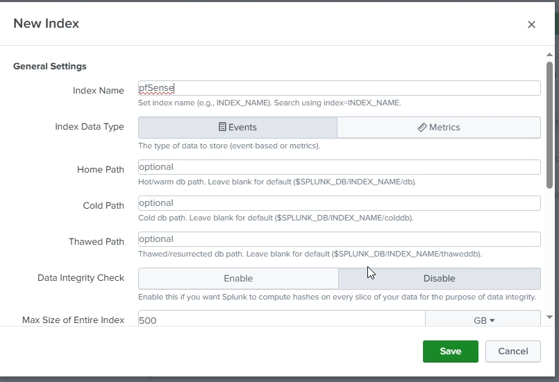  
  

- Puertos 9997 y 9969 habilitados para recepción de logs.  
  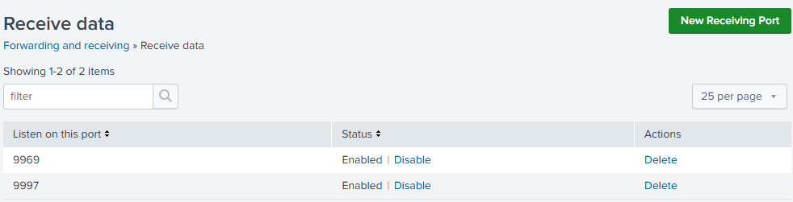

- Regla de firewall para recepción de datos.  
    
    
  

### 7.2. Universal Forwarders

- Instalación de UF en Windows Server  
    
  

- Instalación de UF en Ubuntu Server  
  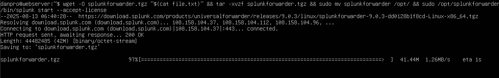

- Instalación de UF en estaciones de trabajo  
  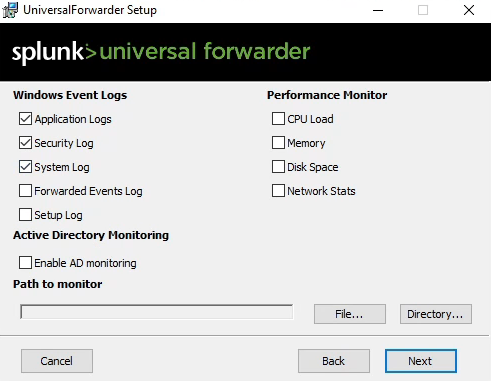  
  

- Configuración de redirección de logs de pfSense  
  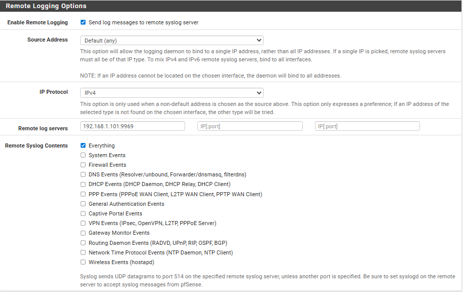

- Habilitar recepción de logs por UDP  
  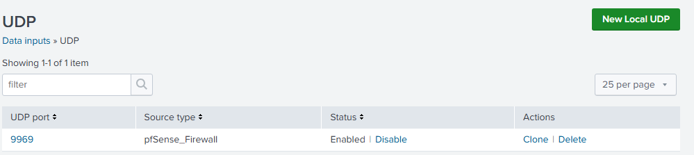

**Comentarios**

- La regla de firewall en Windows Server es obligatoria para recibir datos por el puerto 9997.
- El input UDP permite recibir logs de pfSense sin forwarder.
- La selección de logs en Ubuntu Server cubre eventos clave del sistema.

## 8. Suricata IDS/IPS

### 8.1. Instalación

- Instalado desde el Package Manager de pfSense.  
  

- Interfaces activas: WAN, LAN, DMZ.  
  

- Redirección de logs a System Log para Splunk.  
  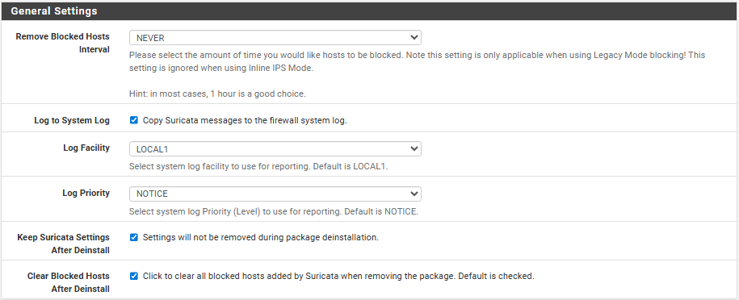

### 8.2. Configuración Crítica

- Desactivación de:

  - Hardware Checksum Offloading
  - TCP Segmentation Offloading
  - Large Receive Offloading

  

### 8.3. Reglas activadas

- ET Open Rules y Snort GPLv2 Rules activadas.  
  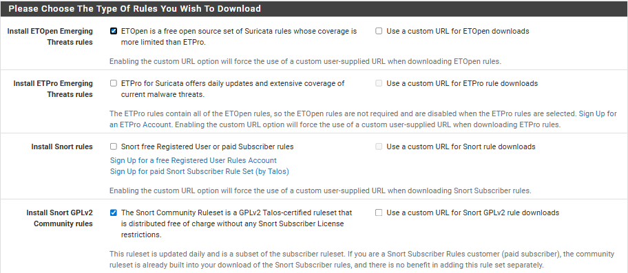

- WAN configurada como IPS (bloqueo activo)  
  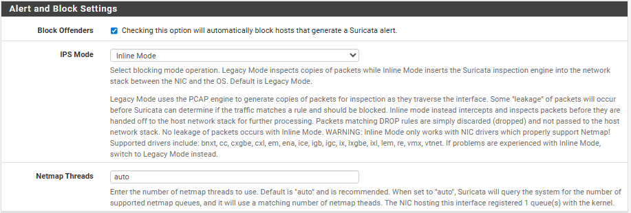

**Comentarios**

- Si no se desactivan las opciones de offloading, Suricata puede bloquear tráfico DNS por checksums inválidos.
- Las reglas ETOpen y Snort GPLv2 fueron elegidas ya que son libres y no requieren autenticación.

## 9. Configuración de Nessus

### 9.1. Instalación

- Nessus Essentials instalado en Windows Server.  
  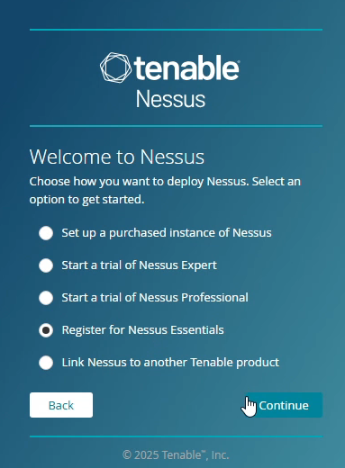

- Activación de escaneo autenticado mediante SSH en Ubuntu Server.
  - SSH instalado  
    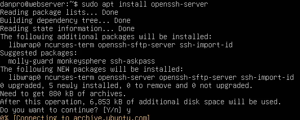

### 9.2. Implementación de escaneos

- Creación de escaneos  
    
  

### 9.3. Escaneos Realizados

| **Nombre del Escaneo** | **Zona** | **Tipo de Escaneo** | **Autenticado** | **Resultado** |
|------------------------|----------|---------------------|-----------------|---------------|
| LAN Scan               | LAN      | Completo            | Sí              |               |
| DMZ Scan               | DMZ      | Puertos + SSH       | Sí              |               |

- LAN Scan  
  

- DMZ Scan  
  

**Comentarios**

- El servicio SSH en Ubuntu Server permite que Nessus acceda a la DMZ.
- Los escaneos están diseñados para evaluar vulnerabilidades en ambas zonas de red.

## 10. Reglas de Firewall (pfSense)

### 10.1. Reglas LAN

| **Acción** | **Protocolo** | **Puerto** | **Destino**    | **Descripción**                    |
|------------|---------------|------------|----------------|------------------------------------|
| Permitir   | DNS           | 53         | Internet       | Resolución de nombres              |
| Permitir   | HTTPS         | 443        | Internet       | Acceso web seguro                  |
| Permitir   | HTTP          | 80         | pfSense GUI    | Gestión desde Windows Server       |
| Permitir   | SSH           | 22         | LAN / DMZ      | Escaneo autenticado desde Nessus   |
| Permitir   | HTTP          | 80         | DMZ            | Acceso a servidor web Ubuntu       |
| Permitir   | ICMP          | --         | DMZ            | Pruebas de conectividad            |
| Permitir   | TCP           | 9997       | Windows Server | Recepción de logs desde estaciones |
| Bloquear   | Todos         | --         | --             | Tráfico no autorizado              |

### 10.2. Reglas DMZ (em3)

| **Acción** | **Protocolo** | **Puerto** | **Destino**    | **Descripción**                   |
|------------|---------------|------------|----------------|-----------------------------------|
| Permitir   | TCP           | 9997       | Windows Server | Envío de logs desde Ubuntu Server |
| Bloquear   | Todos         | --         | --             | Tráfico no autorizado             |

### 10.3. Reglas WAN

| **Acción** | **Protocolo** | **Puerto** | **Destino** | **Descripción**                |
|------------|---------------|------------|-------------|--------------------------------|
| Permitir   | TCP           | 80/443     | DMZ         | Acceso externo a servicios web |

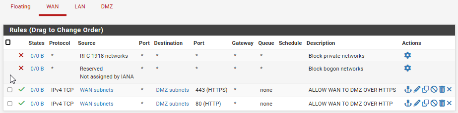

## 11. Pruebas y Validación

### 11.1. Casos de Prueba

| **Componente** | **Prueba**                     | **Resultado** |
|----------------|--------------------------------|---------------|
| Splunk         | Recepción de logs desde UF     | Correcto      |
| AD DS          | Unión de estaciones al dominio | Correcto      |
| Suricata       | Detección de alertas IDS/IPS   | Correcto      |
| Nessus         | Escaneo autenticado en LAN/DMZ | Correcto      |

- Splunk
  - Logs al índice "Windows"  
    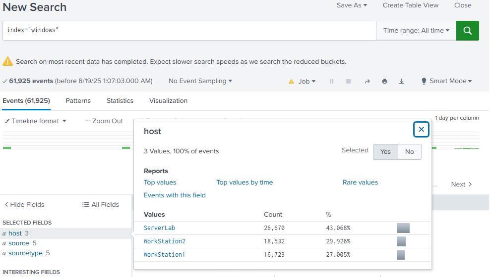

  - Logs al índice "Ubuntu_Server"  
    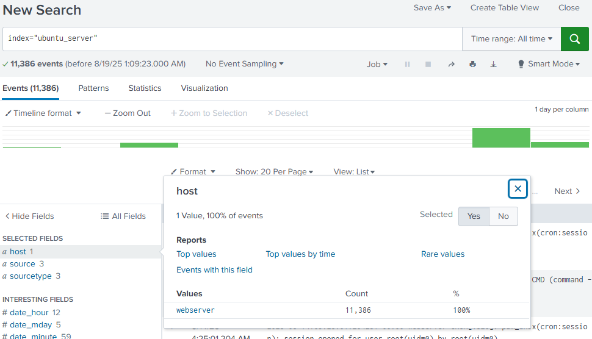

  - Logs al índice "pfSense"  
    

- AD DS  
  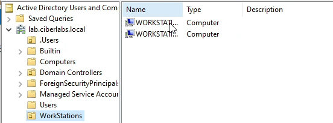

- Suricata  
  

- Nessus
  - LAN Scan  
    

  - DMZ Scan  
    

## 12. Lecciones Aprendidas y Recomendaciones

### 12.1. Retos Técnicos

- Splunk Free limita el volumen de datos y retención.

- Suricata requiere desactivar el offloading para evitar falsos positivos.

### 12.2. Recomendaciones

- Considerar migración a Splunk Enterprise para mayor capacidad.

## 13. Conclusión

Este laboratorio representa una plataforma completa para simular
escenarios reales de ciberseguridad. La integración de herramientas
clave permite practicar detección, análisis y respuesta ante incidentes.
La segmentación de red, el monitoreo centralizado y la validación
operativa consolidan un entorno ideal para aprendizaje técnico y
demostración profesional.
