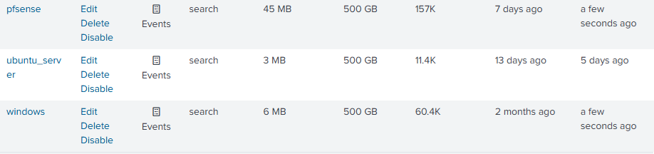

# Project_

**Project title:** Homelab implementation for practices of
Cybersecurity

**Author:** Daniel Carrión

**Role:** Systems engineering student (6th cycle)

**Correo:** [carriondaniel602@gmail.com](mailto:carriondaniel602@gmail.com) · **GitHub:** [@DanproTDT](https://github.com/DanproTDT) · **LinkedIn:** [linkedin.com/in/dacarrionsec](https://www.linkedin.com/in/dacarrionsec)

**Last update date:** 05-20-2025

## 1. Summary

**General objective**: Design and implement a virtual environment
controlled to simulate real cybersecurity scenarios,
including penetration tests, vulnerability management,
event monitoring and incident response. This laboratory seeks
strengthen technical skills through operational practices,
integrating key tools such as Pfsense, Suricata, Splunk, Nessus and
Active Directory.

**Technical reach**: Essential services such as Active were deployed
Directory, DNS, DHCP, IDS/IPS, SIEM and Escane of Vulnerabilities. He
environment includes work stations, Linux and Windows servers, and
Segmented areas (LAN, DMZ, WAN).

**Key results**

- Splunk receives logs of stations, servers and pfsense.

- Suricata detects and blocks malicious traffic.

- Nessus identifies vulnerabilities in LAN and DMZ.

- Firewall rules correctly segment traffic.

## 2. Context and motivation

**Personal motivation**: The creation of this laboratory responds to
desire to acquire practical experience in offensive cybersecurity and
defensive. The environment allows to validate theoretical knowledge through
real simulations, facilitating discovery learning and
Continuous improvement.

**Initial challenges**

- Segmented network configuration with multiple interfaces.

- Integration of tools with consistent logs flows.

- Validation of connectivity between areas for authenticated scan.

**Expected benefits**

- Consolidation of technical skills in real environments.

- Preparation for certifications such as Compia Linux+, Security+, etc.

- Creation of a demonstrable technical portfolio.

## 3. Detailed objectives

- Segment Wan / LAN / DMZ with PFSENSE.

- Deploy Active Directory + DNS in LAN.

- Integrate SOUTHETICS AS IDS/IPS.

- Install and configure Splunk Enterprise + Universal Forwarders.

- Execute vulnerabilities audits with Nessus.

## 4. Network architecture

### 4.1. Subnet table

|**Area**|**Subnet**|**Gateway**|**Function**|
| --------- | --------------- | ------------ | ------------------------------ |
| Wan | DHCP ISP | - | Internet access |
| Lan | 192.168.1.0/24 | 192.168.1.1 | AD DS, Splunk, Nessus, customers |
| DMZ | 10.0.0.0/24 | 10.0.0.1 | Ubuntu Server, Web Services |

### 4.2. PFSENSE interfaces

| **Interface** | **Zone** | **Adapter** |**Function**| **IP**
|-------|-------|----------| ------------- |------- 
| em0   | Wan   | Nat      | Internet connection | Assigned by ISP |
| em1   | DMZ   | Internal | Safe public network | 10.0.0.1/24 |
| em2   | Lan   | Internal | Internal network | 192.168.1.1/24 |

## 5. Component inventory

### 5.1. Hardware / VMS

|**Component**|**RAM**|**CPU**|**Storage**|**Adapters**| **Type**                   |
| -------------------- | -------- | --------- | ----------------- | ------------------ |-------------------------
| pfsense | 2GB | 2 | 20GB | 3 | Nat, internal, internal |
| Windows Server | 4GB | 3 | 50GB | 1 | Internal (LAN)          |
| Ubuntu server | 4GB | 2 | 30GB | 1 | Internal (dmz)          |
| Stations win10/11 | 4GB | 4 | 80GB | 1 | Internal (LAN)          |

### 5.2. Software and versions

- pfSense 2.8.0 + Suricata 7.0.8_2
- Windows Server 2022
- Splunk Enterprise 10.0.0 + UF 10.0.0
- Nessus essentials 10.9.2

## 6. Base implementation

### 6.1. Pfsense

- installation from ISO and interface allocation.
    

  

- Initial configuration via http from Kali Linux temporary.
  

- Assignment of static IPS in LAN and DMZ, and DHCP in LAN.
    

    

  

**Comments**

- If the .iso is not removed, Pfsense restarts the Setup as if it were the first time.
- Kali Linux is used as a temporary bridge to access HTTP management.
- The OPT interface is renowned to DMZ to reflect its function.

### 6.2. Active Directory + DNS

- Windows Server installation from .iso.
  

- Installation of ad ds role in Windows Server.
  

- Domain creation: Lab.ciberlabs.local.
  

- Static IP allocation to Windows Server via DHCP Static Mapping in Pfsense.
  

**Comments**

- The static IP guarantees stable connectivity for domain services.

### 6.3. Work stations + Ubuntu Server

- Windows 11 installation from .iso.
  

- Add DNS Server record so that the stations can obtain the IP of the Windows Server.
  

- Join to domain.
    

  

- Creation of OUS (Workstations, Users) and users (Jhon1, Jhon2).
    

    

    

    

  

- Ubuntu Server installation from .iso
    

  

- Static IP allocation by DHCP Static Mapping to Ubuntu Server.
  

- Web hosting with Apache
    

  

- Creation of GPO for work stations
  

- Enable ICMP by Firewall in GPO
  

**Comments**

- The registration in PFSENSE is key for the stations to solve the domain correctly.
- The GPO allows to verify connectivity between ping stations.
- Apache is installed as a basis for future penetration tests.

## 7. Splunk Enterprise + Universal Forwarders

### 7.1. Splunk Enterprise

- Installation in Windows Server.
    

  

- Created indices: Windows, Ubuntu_Server, Pfsense.
    

  

- Ports 9997 and 9969 enabled for logs reception.
  

- Firewall rule for data reception.
    

    

  

### 7.2. Universal Forwarders

- Installation of UF in Windows Server
    

  

- Installation of UF in Ubuntu Server
  

- Installation of UF in work stations
    

  

- PFSENSE LOGS Redirection Configuration
  

- Enable Logs by UDP
  

**Comments**

- The Firewall rule in Windows Server is mandatory to receive data from port 9997.
- Input UDP allows you to receive PFSENSE logs without Forwarder.
- The selection of Logs in Ubuntu Server covers key events of the system.

## 8. Suricata IDS/IPS

### 8.1. Installation

- Installed from the PFSENSE Package Manager.
  

- Active interfaces: WAN, LAN, DMZ.
  

- Redirection of Logs to System Log for Splunk.
  

### 8.2. Critical configuration

- Deactivation of:

- Hardware Checksum offloading
- TCP Segmentation offloading
- Lark Receive Offloading

  

### 8.3. Activated rules

- ET Open RULES AND SNORT GPLV2 RULES ACTIVATED.
  

- Wan configured as IPS (active block)
  

**Comments**

- If offloading options are not deactivated, Suricata can block DNS traffic by invalid checksums.
- Etopen and Snort GPLV2 rules were chosen as they are free and do not require authentication.

## 9. Nessus configuration

### 9.1. Facility

- Nessus essentials installed in Windows Server.
  

- Authenticated scan activation by SSH in Ubuntu Server.
- SSh installed
    

### 9.2. Scanning implementation

- Creation of scanning
    

  

### 9.3. Scanns made

|**Scan name**|**Area**|**Type of scan**|**Authenticated**|**Result**|
|-----|-----|------|-----|----|
| Lan scan | Lan | Complete | Yes |--------|
| Dmz scan | DMZ | Ports + SSH | Yes |-------|

- LAN SCAN
  

- DMZ Scan
  

**Comments**

- The SSH service in Ubuntu Server allows NESSUS to access the DMZ.
- The scans are designed to evaluate vulnerabilities in both network areas.

## 10. Firewall Rules (Pfsense)

### 10.1. LAN RULES

|**Action**|**Protocol**|**Port**|**Destination**|**Description**|
| ----------- | -------------- | ---------- | -------------- | ------------------------------------------------------------------------------
| Allow | DNS | 53 | Internet | Name resolution |
| Allow | Https | 443 | Internet | SAFE WEB ACCESS |
| Allow | Http | 80 | pfsense gui | Management from Windows Server |
| Allow | Ssh | 22 | LAN / DMZ | Authenticated scan from Nessus |
| Allow | Http | 80 | DMZ | Access to Ubuntu Web Server |
| Allow | ICMP | - | DMZ | Connectivity tests |
| Allow | TCP | 9997 | Windows Server | Reception of logs from stations |
| Block | All | - | - | Unauthorized traffic |

### 10.2. DMZ Rules (EM3)

|**Action**|**Protocol**|**Port**|**Destination**|**Description**|
| ----------- | -------------- | ----------- | --------------- | -----------------------------------
| Allow | TCP | 9997 | Windows Server | LOGS sending from Ubuntu Server |
| Block | All | - | - | Unauthorized traffic |

### 10.3. WAN Rules

| **Action**  |**Protocol**|**Port**|**Destination**|**Description**|
|-------------|-----------|--------------|----------|------------------|
| Allow       | TCP | 80/443 | DMZ | External access to web services |

## 11. Tests and validation

### 11.1. Test cases

|**Component**|**Proof**| **Result**         |
| -------------- | -------------------------|--------------------|
| Splunk | Reception of Logs from UF | Correct            |
| Ad ds | Union of domain stations | Correct            |
| Suricata | IDS/IPS alert detection | Correct            |
| NESSUS | Authenticated scan in LAN/DMZ | Correct            |

- Splunk
- Logs to the "Windows" index
    

- Logs to the "Ubuntu_Server" index
    

- Logs to the "PfSense" index
    

- AD ds
  

- Suricata
  

- Nessus
- LAN SCAN
    

- DMZ Scan
    

## 12. Lessons learned and recommendations

### 12.1. Technical challenges

- Splunk Free limits the volume of data and retention.

- Suricata requires deactivating offloading to avoid false positives.

### 12.2. Recommendations

- Consider migration to Splunk Enterprise for greater capacity.

## 13. Conclusion

This laboratory represents a complete platform to simulate
real cybersecurity scenarios. Integration of tools
Key allows to practice detection, analysis and response to incidents.
Network segmentation, centralized monitoring and validation
Operational consolidate an ideal environment for technical learning and
Professional demonstration.
